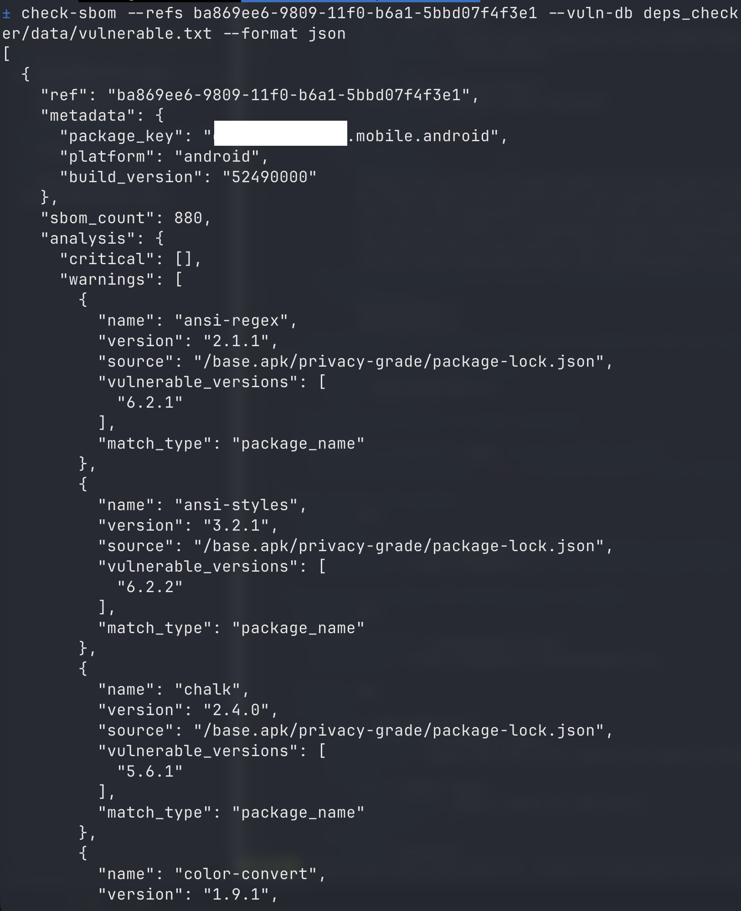

# NowSecure SBOM Vulnerability Checker

A Python tool to fetch and analyze Software Bill of Materials (SBOM) data
from NowSecure's GraphQL API to identify vulnerable dependencies.

## Why This Tool Exists

In September 2025, the npm ecosystem experienced two major supply chain attacks that compromised hundreds of packages used by millions of developers worldwide:

1. **The First Wave** ([September 8, 2025](https://www.nowsecure.com/blog/2025/09/08/major-npm-supply-chain-attack-potential-impact-on-mobile-applications/)): Attackers compromised popular packages like `chalk`, `debug`, and `ansi-styles` with over 2 billion weekly downloads, injecting malware designed to intercept cryptocurrency transactions and steal credentials.

2. **The Second Wave** ([September 16, 2025](https://www.nowsecure.com/blog/2025/09/16/new-npm-supply-chain-attack-hits-187-packages-heres-why-mobile-apps-are-still-at-risk/)): 187 additional packages were compromised, particularly targeting mobile development ecosystems including NativeScript, Angular mobile components, and React Native adjacent packages.

### Why Mobile Apps Are at Risk

Modern mobile applications frequently use JavaScript dependencies through:
- **Hybrid frameworks**: React Native, Ionic, Cordova, NativeScript
- **Backend services**: Node.js APIs and services that mobile apps connect to
- **Build tools**: Development and CI/CD pipeline dependencies

These compromised packages can:
- Steal authentication tokens and API keys
- Intercept network traffic
- Exfiltrate sensitive user data
- Modify application behavior

### How This Tool Helps

`deps_checker` helps security teams and developers:
- **Rapidly identify** compromised npm packages in mobile applications
- **Scan SBOM data** from NowSecure assessments to detect vulnerable dependencies
- **Track specific versions** of packages known to be malicious
- **Enable quick response** to supply chain attacks by checking entire app portfolios

The tool includes a curated database of compromised package versions from these attacks, including packages like `chalk@5.6.1`, `debug@4.4.2`, and hundreds of others identified in the supply chain compromises.

## Features

- Query NowSecure GraphQL API for SBOM data
  - Note: Uses latest complete assessment
- Check dependencies against known vulnerable version
  - this project provides a [sample database](deps_checker/data/vulnerable.txt)
- Support for batch processing multiple applications
- Multiple output formats (text, JSON, CSV)
- No external dependencies (uses Python standard library only)

## Demo

Here's what the tool looks like in action:



The tool provides clear output showing:
- 🔴 **Critical vulnerabilities**: Exact version matches with known vulnerable packages
- ⚠️ **Warnings**: Package name matches that may indicate potential issues
- **Summary statistics**: Total counts and vulnerability status
- **Multiple output formats**: Text (shown), JSON, and CSV options

## Requirements

- Python 3.7+
- NowSecure API key

## Installation

### Option 1: Install as Package (Recommended)

Clone the repository and install:
```bash
git clone <repository-url>
cd deps_checker
pip install -e .
```

This will install the `check-sbom` command globally.

### Option 2: Run from Source

Clone the repository:
```bash
git clone <repository-url>
cd deps_checker
```

Run directly with Python:
```bash
python -m deps_checker.cli --help
```

## Usage

### Getting Application References

The tool requires NowSecure application reference UUIDs (refs) to analyze SBOM data. These are unique identifiers for mobile applications in your NowSecure platform.

**To find your application refs:**
1. Log in to your NowSecure Platform
2. Navigate to your applications list
3. Click on an application to view its details
4. Copy the application UUID from the URL or application details page
   - Example: `123e4567-e89b-12d3-a456-426614174000`

**Note:** The tool uses the latest complete assessment for each application reference.

### Basic Usage

Check a single application:
```bash
# If installed as package
check-sbom --ref "uuid-here" --api-key "your-api-key" --vuln-db deps_checker/data/vulnerable.txt

# If running from source
python -m deps_checker.cli --ref "uuid-here" --api-key "your-api-key" --vuln-db deps_checker/data/vulnerable.txt
```

Using environment variable for API key:
```bash
export NS_API_KEY="your-api-key"
check-sbom --ref "uuid-here" --vuln-db deps_checker/data/vulnerable.txt
```

You can also use the sample environment file as a template:
```bash
cp .env.sample .env
# Edit .env with your actual API key
source .env
check-sbom --ref "uuid-here" --vuln-db deps_checker/data/vulnerable.txt
```

### Multiple Applications

Check multiple applications at once:
```bash
check-sbom --refs "uuid1" "uuid2" "uuid3" --api-key "your-api-key" --vuln-db deps_checker/data/vulnerable.txt
```

Read references from a file:
```bash
check-sbom --refs-file app_refs.txt --api-key "your-api-key" --vuln-db deps_checker/data/vulnerable.txt
```

### Output Formats

JSON output:
```bash
check-sbom --ref "uuid" --api-key "key" --vuln-db deps_checker/data/vulnerable.txt --format json > results.json
```

CSV output:
```bash
check-sbom --ref "uuid" --api-key "key" --vuln-db deps_checker/data/vulnerable.txt --format csv > results.csv
```

Verbose text output:
```bash
check-sbom --ref "uuid" --api-key "key" --vuln-db deps_checker/data/vulnerable.txt --verbose
```

Debug mode (errors propagate for easier debugging):
```bash
check-sbom --ref "uuid" --api-key "key" --vuln-db deps_checker/data/vulnerable.txt --debug
```

### Vulnerability Database

The `--vuln-db` argument is required and specifies which vulnerability database to use. For the full vulnerability database, use the included data file:
```bash
check-sbom --ref "uuid" --api-key "key" --vuln-db deps_checker/data/vulnerable.txt
```

You can also provide custom vulnerabilities via JSON or TSV files:
```bash
check-sbom --ref "uuid" --api-key "key" --vuln-db custom_vulns.json
```

**Supported formats:**
- **TSV/TXT**: Tab-separated values with format `package<tab>version(s)`. Supports comma-separated multiple versions.
- **JSON**: Object with package names as keys and arrays of versions as values.

**TSV format example:**
```
package	versions
debug	4.4.2
chalk	5.6.1
supports-color	10.2.1,1.2.3
@art-ws/config-eslint	2.0.4, 2.0.5
```

**JSON format example:**
```json
{
  "package-name": ["1.0.0", "1.0.1"],
  "another-package": ["2.3.4"]
}
```

## Using as a Python Library

After installation, you can also import and use the components programmatically:

```python
from deps_checker import SBOMChecker, VulnerabilityDatabase

# Initialize checker
checker = SBOMChecker(api_key="your-api-key")
checker.load_vulnerability_database("deps_checker/data/vulnerable.txt")

# Check a single application
result = checker.check_application("uuid-here")
print(f"Vulnerabilities found: {result['summary']['has_vulnerabilities']}")

# Work with vulnerability database directly
vuln_db = VulnerabilityDatabase()
vuln_db.load_from_file("deps_checker/data/vulnerable.txt")
is_vulnerable = vuln_db.is_vulnerable_exact("chalk", "5.6.1")
```

## Exit Codes

- `0` - No vulnerabilities found
- `1` - Vulnerabilities detected or error occurred

## Default Vulnerable Packages

The tool checks against vulnerable packages listed in the [`vulnerable.txt`](./deps_checker/data/vulnerable.txt) file by default.

## Output Examples

### Text Output (with --verbose flag)
```
Application Ref: 123e4567-e89b-12d3-a456-426614174000
  Package: com.example.app
  Platform: ios
  Total SBOM Items: 45

  CRITICAL - Exact vulnerable version matches (2):
    • debug v4.4.2
      Known vulnerable versions: 4.4.2
    • chalk v5.6.1
      Known vulnerable versions: 5.6.1

  WARNING - Package name matches (1):
    • ansi-styles v6.2.0
      Known vulnerable versions: 6.2.2
```

Note: The "Known vulnerable versions" details are shown when using the `--verbose` flag.

### JSON Output Structure
```json
{
  "ref": "uuid",
  "metadata": {
    "package_key": "com.example.app",
    "platform": "ios"
  },
  "sbom_count": 45,
  "analysis": {
    "critical": [...],
    "warnings": [...]
  },
  "summary": {
    "total_critical": 2,
    "total_warnings": 1,
    "has_vulnerabilities": true
  }
}
```

## Integration with CI/CD

The tool returns exit code 1 when vulnerabilities are found, making it suitable for CI/CD pipelines:

```bash
check-sbom --refs-file apps.txt --api-key "$NS_API_KEY" --vuln-db deps_checker/data/vulnerable.txt --format json > results.json
if [ $? -eq 1 ]; then
    echo "Vulnerabilities found!"
    exit 1
fi
```
