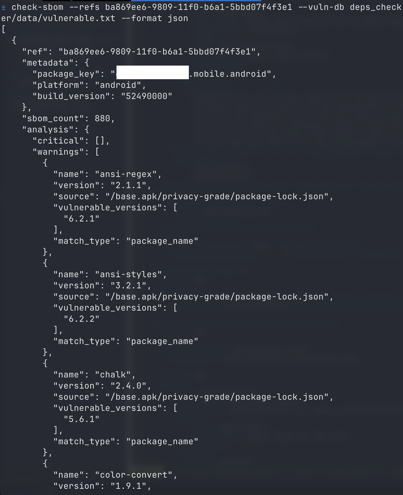

# Usage

## Install

### Install as a package

```bash
git clone https://github.com/dweinstein/deps_checker.git
cd deps_checker
python3 -m pip install -e .
```

This installs the `check-sbom` command.

The project uses the Python standard library for runtime behavior.

### Run from source

```bash
git clone https://github.com/dweinstein/deps_checker.git
cd deps_checker
python3 -m deps_checker.cli --help
```

## How App Selection Works

The tool checks the latest complete assessment for each requested application reference.

## Finding Application Refs

Application refs are the UUIDs NowSecure uses to identify apps.

Typical workflow:

1. Log in to NowSecure.
2. Open the applications list.
3. Open an application.
4. Copy the application UUID from the URL or app details.

Example:

```text
123e4567-e89b-12d3-a456-426614174000
```

You can provide apps in four ways:

### Single app

```bash
check-sbom --ref "uuid-here" --api-key "your-api-key" --fetch-shai-hulud
```

### Multiple app refs on the command line

```bash
check-sbom --refs "uuid1" "uuid2" "uuid3" --api-key "your-api-key" --fetch-shai-hulud
```

### Refs from a file

The file should contain one UUID per line.

```bash
check-sbom --refs-file app_refs.txt --api-key "your-api-key" --fetch-shai-hulud
```

Example: [`example_refs.txt`](../example_refs.txt)

### Every app in your account

```bash
check-sbom --all-app-refs --api-key "your-api-key" --fetch-shai-hulud
```

When `--verbose` is enabled with `--all-app-refs`, the CLI prints the discovered package, platform, and ref list to stderr before scanning.

## API Key

Pass the key directly:

```bash
check-sbom --all-app-refs --api-key "your-api-key" --fetch-shai-hulud
```

Or set `NS_API_KEY`:

```bash
export NS_API_KEY="your-api-key"
check-sbom --all-app-refs --fetch-shai-hulud
```

## Custom Endpoint

The default GraphQL endpoint is `https://api.nowsecure.com/graphql`.

Override it when needed:

```bash
check-sbom --all-app-refs --api-key "$NS_API_KEY" --fetch-shai-hulud --endpoint "https://your-nowsecure-endpoint/graphql"
```

## Output Formats

### Text output

Default format:

```bash
check-sbom --ref "uuid" --api-key "key" --fetch-shai-hulud
```

With extra details:

```bash
check-sbom --ref "uuid" --api-key "key" --fetch-shai-hulud --verbose
```

Example:

```text
Application Ref: 123e4567-e89b-12d3-a456-426614174000
  Package: com.example.app
  Platform: ios
  Total SBOM Items: 45

  CRITICAL - Exact vulnerable version matches (2):
    • debug v4.4.2
      Known vulnerable versions: 4.4.2
    • chalk v5.6.1
      Known vulnerable versions: 5.6.1

  WARNING - Package name matches (1):
    • ansi-styles v6.2.0
      Known vulnerable versions: 6.2.2
```

### JSON output

```bash
check-sbom --all-app-refs --api-key "$NS_API_KEY" --fetch-shai-hulud --format json > results.json
```

Structure:

```json
[
  {
    "ref": "uuid",
    "metadata": {
      "package_key": "com.example.app",
      "platform": "ios",
      "build_version": "1.2.3"
    },
    "sbom_count": 45,
    "analysis": {
      "critical": [],
      "warnings": []
    },
    "summary": {
      "total_critical": 0,
      "total_warnings": 0,
      "has_vulnerabilities": false,
      "unique_vulnerable_packages": 0,
      "unique_warning_packages": 0
    }
  }
]
```

### CSV output

```bash
check-sbom --all-app-refs --api-key "$NS_API_KEY" --fetch-shai-hulud --format csv > results.csv
```

Columns:

```text
ref,package_key,platform,sbom_count,critical_count,warning_count,error
```

## Debug Mode

`--debug` disables the normal per-app exception handling and lets errors propagate. That is useful when you want stack traces or the full raw failure behavior.

```bash
check-sbom --ref "uuid" --api-key "key" --fetch-shai-hulud --debug
```

## CI/CD

The CLI exits with code `1` when at least one scanned app has a `CRITICAL` finding. Fatal startup/runtime failures also exit with `1`.

```bash
check-sbom --refs-file apps.txt --api-key "$NS_API_KEY" --fetch-shai-hulud --format json > results.json
if [ $? -eq 1 ]; then
    echo "Vulnerabilities found or the run failed before producing results"
    exit 1
fi
```

In normal mode, application-specific query failures are returned in the result payload under `error` and do not by themselves cause a nonzero exit code.

## Demo


